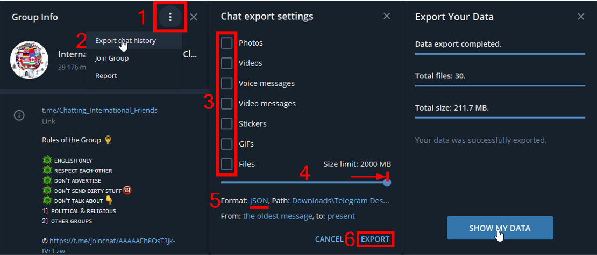
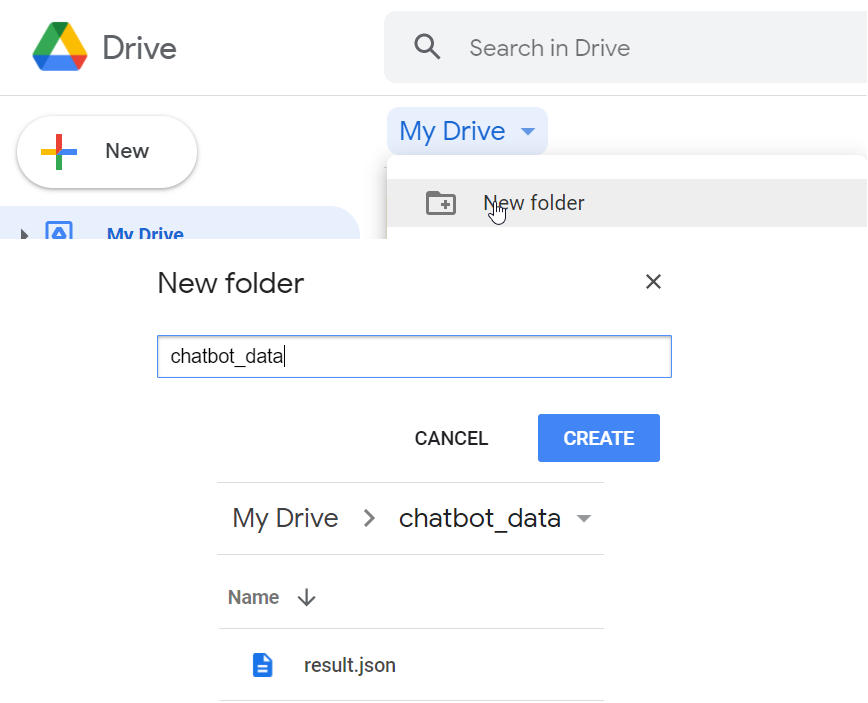
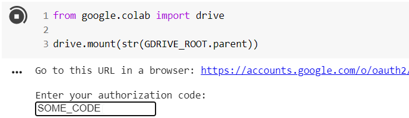
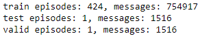
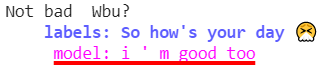
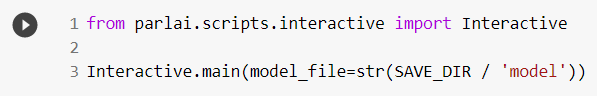

# Chatbot

Train chatbot on your Telegram chat.

## Steps:

1.  Export chat history in the *Group info* menu:

    

2.  Create a new Google Drive (a model checkpoint that replacing old one goes to trash, and it is big enough to fill up your disk quick), create *chatbot_data* folder, and put result.json there:

    

3. Install something like a [colab-alive](https://chrome.google.com/webstore/detail/colab-alive/eookkckfbbgnhdgcbfbicoahejkdoele) extension

4.  Open [train_chatbot.ipynb](https://colab.research.google.com/github/vinnik-dmitry07/Chatbot/blob/main/train_chatbot.ipynb)

5. Go to *Runtime > Run all*

6.  Mount your drive (press enter after pasting a code):

     

7.  Check the train-test-valid split to be correct (i.e. nonzero, big enough)

    

8. After training have started do not close the browser tab until you go out of the quota (about 10 hours)

9. Open [run_chatbot.ipynb](https://colab.research.google.com/github/vinnik-dmitry07/Chatbot/blob/main/run_chatbot.ipynb)

10. Run setup cells (installing parlai, mounting the drive)

11. Run this cell to show what model answers on the test data:

    

    

    ("labels" is what the model was training to answer, "model" is actual model output, more examples are present in a *run_chatbot.ipynb* cell output)

12. To chat with the model run this cell:

    
